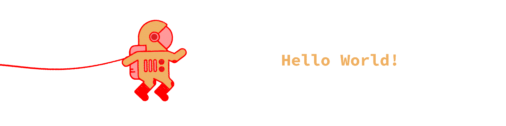

  

---

#### 👨🏽‍🚀 About Me :
Hi! I'm @nando123abc and I enjoy creating in many different mediums. Have a look at my work at [worp.space](http://www.worp.space)

- Currently experimenting and learning new things as a creative technologist. 

- I'm interested in Interactive design, Game Development, AI, Augmented Reality, Virtual Reality, Mixed/Extended Reality, Data Visualization, Web Development, Art, Architecture, and other related fields. 

---

#### 💻 Tools :
- **Programming Language:**  
JavaScript, HTML, CSS, C++, C#, Python  
- **3D/Game:**  
Unreal Engine, Unity3D, 3Ds Max, Cinema 4D, Rhino3D, AutoCad, Blender, SketchUp,  
- **Developer Tools:**  
Git, VS Code, Visual Studio. Open Frameworks, Xcode  
- **SDKs:**  
WebXR, Vuforia, ARKit, ARCore, OpenXR, Three.js, OpenGL 
- **Hardware:**  
Meta Quest2, Meta Quest Pro, Arduino, LEDs, Vicon Motion Capture System, 

<!---
nando123abc/nando123abc is a ✨ special ✨ repository because its `README.md` (this file) appears on your GitHub profile.
You can click the Preview link to take a look at your changes.
--->
